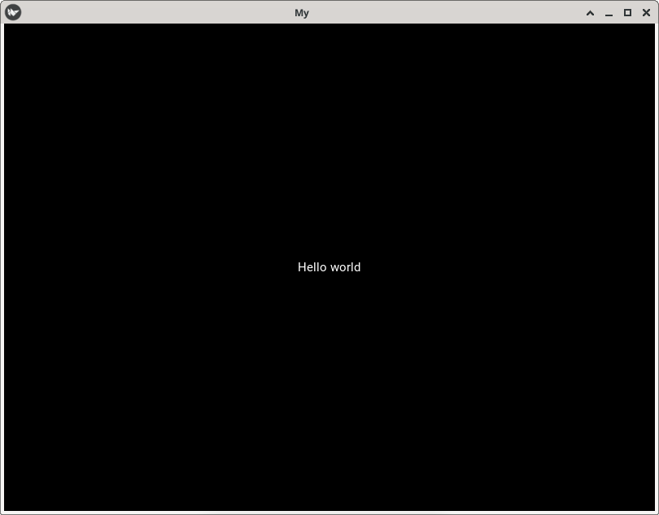

A window should open, showing a single Label (with the Text ‘Hello World’) that covers the entire window’s area. That’s all there is to it.

[🔗](https://kivy.org/doc/stable/guide/basic.html#create-an-application)