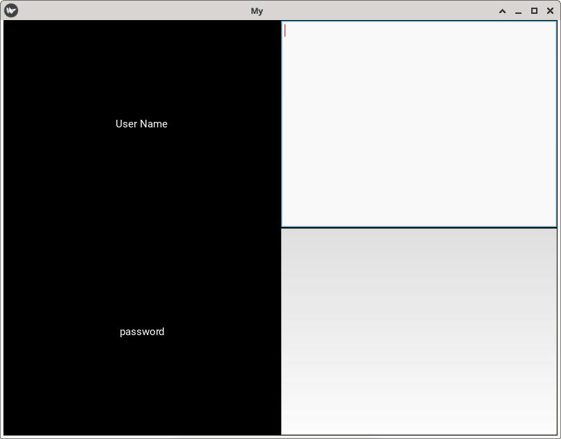

Running the above code will give you a window that should look like this:

Try re-sizing the window and you will see that the widgets on screen adjust themselves according to the size of the window without you having to do anything. This is because widgets use size hinting by default.

The code above doesn’t handle the input from the user, does no validation or anything else. 

[🔗](https://kivy.org/doc/stable/guide/basic.html#customize-the-application)